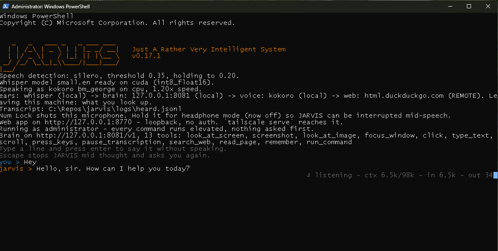
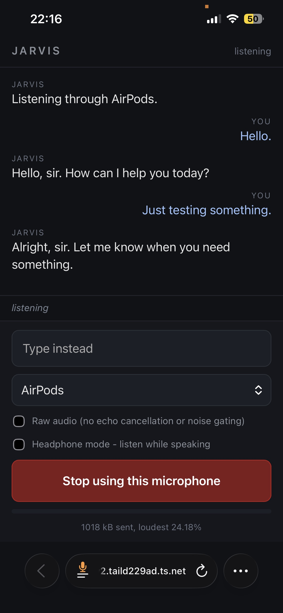

> **J**ust **A** **R**ather **V**ery **I**ntelligent **S**ystem

A voice assistant for a Windows desktop that runs entirely on the machine it is sitting on.
It listens, works out what you wanted, does it - clicking real buttons on real windows,
running real commands - and says what happened. No wake word, no cloud, no API key.

Designed running on a 12 GB RTX 4070 Ti with Qwen3.6-35B-A3B. More setup details in
[`docs/example-configuration.md`](docs/example-configuration.md).

**The reply is the speech.** There is no tool for talking, so there is nothing to forget:
what the model writes is what comes out of the speakers.

**Windows only.** The ears would port; the hands are UI Automation and `SendInput`.



## Setup

```powershell
uv sync
```

You need an OpenAI-compatible endpoint - built against llama.cpp on loopback, with the exact
launcher and hardware in [`docs/example-configuration.md`](docs/example-configuration.md).
It does not have to be up first: JARVIS asks every five seconds for up to ten minutes
(`brain.wait_for_model_seconds`), which is what makes starting both at login work whichever
way round they fire. If nothing ever answers it says so and stops rather than coming up half
working.

```powershell
.\jarvis.ps1 -Windowed   # start it in its own window and return
.\jarvis.ps1             # or run it here and watch the transcript
```

First run downloads Whisper's `base.en`, about 150MB. Then just talk.

```
you > what is the weather in melbourne
  > search_web(query='melbourne weather today')
    1. Melbourne, VIC - Weather  [bom.gov.au]
jarvis > Fifteen degrees and overcast, sir.
```

Everything heard goes through the loop and JARVIS decides what was aimed at it - there is no
name to say. Under the transcript is one live line: the model thinking as it writes, gone
when it answers, with how full the context is at the end of it. Detail goes to
`logs/jarvis.log` (every call, result and thought - `log_max_mb` caps the lot at 100MB) and
every utterance to `logs/heard.jsonl`.

## Talking to it

- **Talk over it.** Speaking abandons the half written answer and the turn carries on knowing
  what you just said. Everything it already found is kept, so "no, the other one" builds on
  the look that has already happened.

- **Or type.** Start typing in the window it is running in and the line goes in exactly where
  speech does. Escape throws it away; escape on an empty line stops whatever it is doing.

- **Num Lock shuts this microphone**, from anywhere, including with an admin window in
  front. Nothing said in the room is transcribed or logged until you press it again. It is
  the desk only: a phone on the web app keeps hearing, so you can leave the room muted and
  still talk to it from the next one. Or just ask - "stop listening, I'm on a call".

- **Hold Num Lock for headphone mode**, which leaves the microphone open while JARVIS is
  talking so you can cut a reply off mid sentence. Off on speakers, where it hears itself and
  once answered its own weather forecast. `audio.listen_while_speaking` is where it starts;
  the key moves it, and so does the button on the web app.

- **A phrase ends after 1.2s of quiet** (`audio.pause_threshold`), set high on purpose:
  being cut off mid sentence is worse than waiting.

```powershell
.\jarvis.ps1 chat        # same loop and same memories, no microphone - works over SSH
```

## On the go



JARVIS serves a page that turns a phone into the microphone: open it, keep it open, talk, and
the reply comes back through the phone rather than out of the speakers at the desk. There is a
text box for when you cannot talk, a microphone picker, a headphone mode checkbox, the same
live line the terminal draws, and the tool calls underneath - tap one for the whole of it. On
by default (`service.start_webapp`).

While a page is open the desk microphone stops being listened to - somebody holding a phone is
not at the desk. Close the tab and it comes back within about half a minute. Speaking through
the browser needs Kokoro; the other engines speak at the desk as usual.

### Reaching it from your phone

The service is loopback with no auth of its own and stays that way - Tailscale goes in front
and does the TLS and the authentication. The https matters: a browser refuses a microphone
outside a secure context, so plain `http://100.x.x.x:8770` will not work even from on the
tailnet.

Once, in the [admin console](https://login.tailscale.com/admin/dns): turn on **MagicDNS** and
**HTTPS Certificates**. Then, on the machine JARVIS runs on:

```powershell
tailscale serve --bg 8770
```

It prints an `https://your-machine.your-tailnet.ts.net/` URL, which is the machine rather than
the session, so it survives reboots and is worth bookmarking. Open it on a phone signed into
the same tailnet, allow the microphone, and press **Mic off** to turn it on.
`tailscale serve status` shows what is served and `tailscale serve reset` stops it.

None of this is on the public internet - that is `tailscale funnel`, a different command, and
this is not a thing to point it at.

## What it remembers

Most of what makes a desk workable is only discoverable by getting it wrong - a window whose
tree is empty until it has been focused, which of four identical buttons is the one that
works. None of that is in a model's weights and the next machine's list is different, so
JARVIS keeps its own.

**It will also learn about you.** A minute after the conversation goes quiet it looks back
over everything since it last did and writes down what was worth keeping - and that includes
what you told it about yourself:
your work, what you are building, what you like, how you want things done. All of it goes in
`context/memories/memories.md`, in plain bullets under headings, on this machine and not in
git. It is yours: open it, delete a line, rewrite a heading, or empty it. `brain.memories =
false` turns the whole thing off.

```
context/
  soul/jarvis.md                        who it is - character, nothing else
  tools/tools.md                        what it can do, generated from tools.py
  memories/memories.md                  everything it has learned, and about you
  memories/navigation/os-navigation.md  how Windows behaves, by hand, shipped
```

Every markdown file under `memories` is read into the prompt, so adding your own is dropping
a file in. `brain.max_memory_chars` caps the grown one - over it, none of it is read and it
says so in red at startup. When the room goes quiet it also rewrites its longest heading
shorter, merging what it has written down more than once.

What it writes down mid conversation lands in `logs/session-memories.md` first and is folded
into the file above when the room goes quiet. That is about speed, not bookkeeping: the
grown file sits at the front of the prompt, and editing the front of a prompt costs the
model the whole conversation again - a minute here, measured, in front of a two word answer.

## The voice

| `tts.engine` | What it is | Cost |
| --- | --- | --- |
| `sapi` | The Windows voice. Concatenative, 1990s, and sounds it | nothing, always there |
| `kokoro` | An 82M neural voice, and the reason this section exists | 330MB on disk |
| `edge` | Microsoft's neural voices, over the network | every reply leaves the machine |
| `none` | Text only | - |

`auto` picks Kokoro if you have downloaded it and SAPI otherwise. Two files, once:

```powershell
uv sync --extra kokoro
mkdir models
$base = "https://github.com/thewh1teagle/kokoro-onnx/releases/download/model-files-v1.0"
curl.exe -L -o models/kokoro-v1.0.onnx "$base/kokoro-v1.0.onnx"
curl.exe -L -o models/voices-v1.0.bin "$base/voices-v1.0.bin"
```

`tts.kokoro_voice` picks who it sounds like, and the first letter picks the accent -
`bm_george` and `bm_lewis` are British men, `bf_emma` British women, `am_`/`af_` American.

## Not hearing your own speakers

A video playing at the desk is speech, and JARVIS used to transcribe it and sometimes answer
it. It does not have to: this machine is the one playing the sound, so it has an exact copy of
what went to the speakers, and what the microphone hears is that copy filtered by the room.
WASAPI hands back the mix going to a render endpoint and WebRTC's AEC3 learns the room and
subtracts it.

```powershell
uv sync --extra kokoro --extra echo    # name every extra you want, see below
```

Then `audio.echo_cancellation = true`. Measured on the desk in
[`docs/example-configuration.md`](docs/example-configuration.md), against a real video at full
volume: 34 dB, which takes Silero from hearing speech in 418 buffers out of 440 to fourteen,
and Whisper from a paragraph of the video to nothing at all. It costs 0.6% of one core, no
VRAM, and about 1.5% word error in a quiet room.

**`audio.echo_reference_delay` is the one number that matters**, and it depends on this
machine rather than on yours. The reference has to arrive inside the canceller's filter, which
reaches back about 100ms. Here 0.12 puts it 64ms ahead of the microphone and cancels 34 dB,
while 0.40 put it 219ms behind and cancelled 1 dB - so if cancellation is poor, this is the
first and probably the only thing to change. It is a straight line: 10ms of it for 10ms of
delay.

Talking over the speakers still works, at the cost of some accuracy - roughly a quarter of
your words when a video is louder than you. `audio.echo_gate_margin` throws away anything not
clearly above the leftover echo, which is stricter and eats quiet speech; it is off because
cancelling turned out to be enough on its own.

One note on the extras, which is a footgun: `uv sync --extra echo` syncs to *only* that extra
and uninstalls the others. Name all of them every time.

## Screen control

Handing a model the whole accessibility tree does not work: a Teams window is 810 nodes and a
35B model given the lot picks something plausible and wrong. So the model never sees the tree
or a coordinate. It gets a numbered list of the 54 things it can actually press, and names a
number with what it expects to be there:

```powershell
.\jarvis.ps1 look "outlook" --matching reply
#    1  Button      Reply
#    2  Button      Reply all
.\jarvis.ps1 click 1 --expecting Reply
```

`--expecting` is checked before anything is pressed, which turns the classic misclick - a
number left over from before the list scrolled - into a refusal. Stale scans, occluded
points and minimised windows are refused too, and anything running as administrator is out of
reach entirely unless you start it with `.\jarvis.ps1 --admin`.

`screen.control = false` leaves the read-only half: looking and screenshots, no pointer.
There is also `screenshot()` and `look_at_image()` for the things a tree cannot describe -
a chart, an error dialog, a page a browser says nothing about.

## What leaves this machine

Nothing, unless you ask for it. Startup prints exactly what each stage is doing:

```
ears: whisper (local) -> brain: 127.0.0.1:8081 (local) -> voice: auto (local). Nothing leaves this machine.
```

| Setting | Sends | To |
| --- | --- | --- |
| `brain.web = true` (default) | your search terms | DuckDuckGo |
| `stt.backend = "google"` | your raw microphone audio | Google |
| `tts.engine = "edge"` | every reply, as text | Microsoft |
| `brain.url` off loopback | every word of every conversation, and any screenshot | wherever it points |

Web search is the one thing on by default that leaves, because there is no local version of
it. `brain.web = false` removes both tools.

## The rest of the commands

```powershell
.\jarvis.ps1 status                # exit 0 if it is up, 2 if not
.\jarvis.ps1 next                  # block until you speak, then print it
.\jarvis.ps1 say "Opening it now"  # speak, muting the mic so it is not heard back
.\jarvis.ps1 look                  # number what is clickable in the window in front
.\jarvis.ps1 click 12 --expecting Reply
.\jarvis.ps1 screenshot            # a picture of the window in front
.\jarvis.ps1 chat                  # type to it instead of speaking, no microphone
.\jarvis.ps1 tools                 # what the brain can do, as the model is told it
.\jarvis.ps1 config                # every setting in effect, and where it came from
.\jarvis.ps1 --list-devices        # find your microphone
```

The service has to be running for most of them - it owns the audio hardware. It runs as
`uv`/`python`, so `Get-Process jarvis` finds nothing; use `jarvis.ps1 status`.

## Configuration

`config/jarvis.json`, then `JARVIS_*` environment variables, then command line flags, each
beating the last. `config/defaults.json` lists every option with its default and is generated
from the code; `config/jarvis.toml.example` is the same thing annotated. Copy only the bits
you want.

## Development

```powershell
uv run pytest        # 674 tests, no hardware, model or network needed
uv run ruff check .
uv run ruff format .
```

[`DESIGN.md`](DESIGN.md) is the long version: how it is put together, why each part is the
shape it is, and every idea that was tried and thrown away.

## License

MIT
